# Getting Started with GitHub: A Complete Beginner’s Guide

## Introduction

GitHub is one of the world’s most popular platforms for version control and collaborative software development.  
It’s built on **Git**, a distributed version control system that tracks changes in your codebase, making it easier for developers and teams to collaborate, manage projects, and contribute seamlessly.  

This **step-by-step GitHub tutorial for beginners** will walk you through:  

- Creating a GitHub account  
- Installing and configuring Git  
- Creating your first repository  
- Making and committing changes  
- Pushing updates to GitHub  

By the end, you’ll have a solid foundation in using GitHub for version control and project collaboration.  

---

## Prerequisites

Before you begin, ensure you have:  

- A computer with internet access (Windows, macOS, or Linux)  
- A GitHub account — sign up at [GitHub](https://github.com)  
- Git installed — download from [Git SCM](https://git-scm.com/downloads)  
- A text editor (recommended: [Visual Studio Code](https://code.visualstudio.com/))  

---

## Step-by-Step GitHub Tutorial

### 1) Create a GitHub Account

1. Go to [https://github.com](https://github.com)
    
   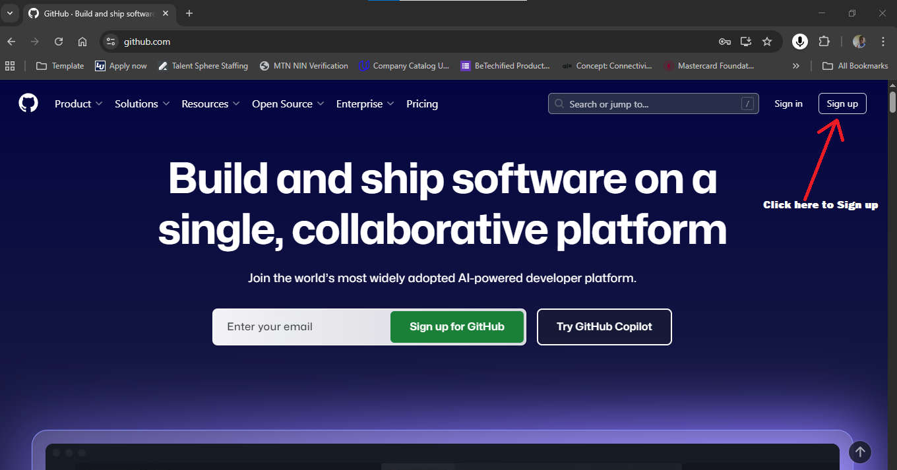
    
   *Figure 1: GitHub homepage, where you can access the sign-up process.*

2. Click **Sign up** and follow the prompts.
     
   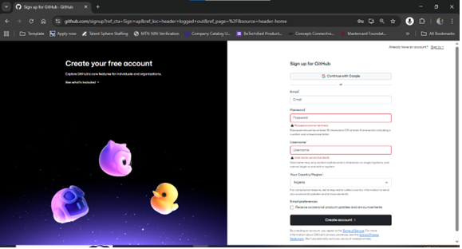
    
   *Figure 2: GitHub sign-up page for creating a new account.*

3. Verify your email address to activate your account.  

---

### 2) Install Git

1. Download Git from [https://git-scm.com/downloads](https://git-scm.com/downloads).
    
   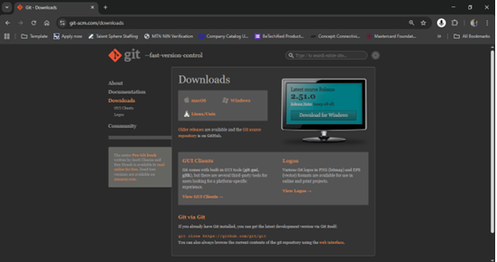
   
   *Figure 3: Official Git SCM website where you can download Git.*  

2. Accept default installation settings unless you have specific preferences.  

3. Confirm installation:  

**Option 1: Using Command Prompt (Windows)**  

- Press **Windows Key + R**, type `cmd`, and press Enter.
   
  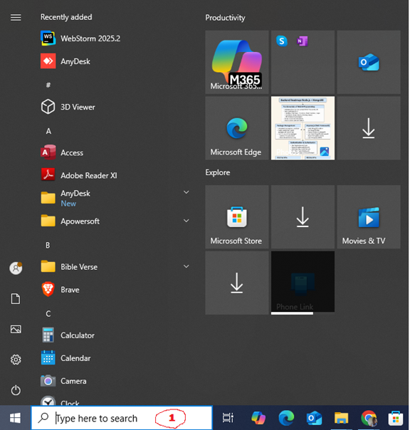
  
  *Figure 4: Opening Command Prompt via Run dialog.*  

- Type `cmd` and open.
  
  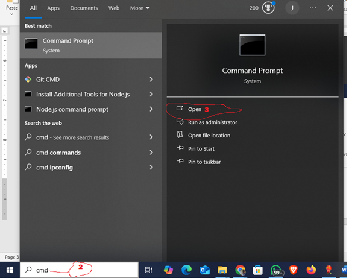
  
  *Figure 5: Entering "cmd" to open the terminal.*  

- A terminal window opens.
  
  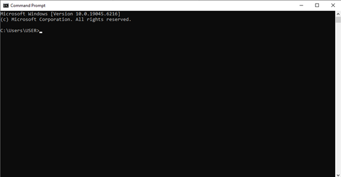
  
  *Figure 6: Command Prompt successfully opened.*  

- Type:  
  
  ```bash

  git --version

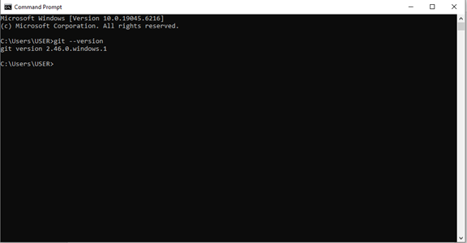

*Figure 7: Git version confirmation in Command Prompt.*

---

**Option 2: Using Git Bash**  

After installation, search for **Git Bash** in the Start menu. 

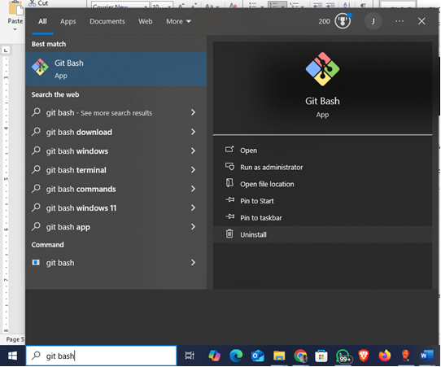

*Figure 8: Opening Git Bash terminal.*

- Run:  
  
  ```bash

  git --version to verify installation.


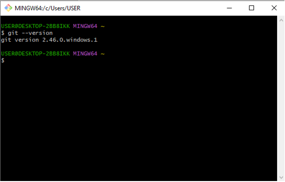

*Figure 9: Git Bash confirming Git installation.*


### 3) Configure Git  

Set up your Git username and email (used for commits):  

- git config --global user.name "Your Name"
- git config --global user.email [you@example.com](you@example.com)

### 4) Create Your First Repository (on GitHub)

1. Click the **+** icon in the top-right → **New repository**.
   
   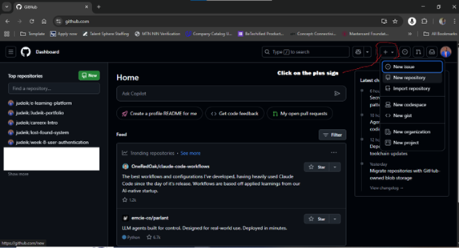

   *Figure 10: Creating a new repository in GitHub.*

3. Enter a repository name (e.g., `my-first-repo`) and description.
  
   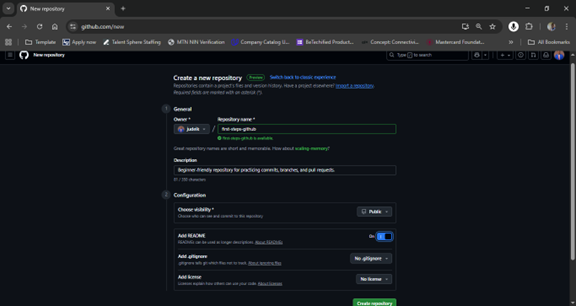

   *Figure 11: Naming and describing a new repository.*

4. Choose **Public** or **Private**.

5. Select **Add a README file** → Click **Create repository**.
   
   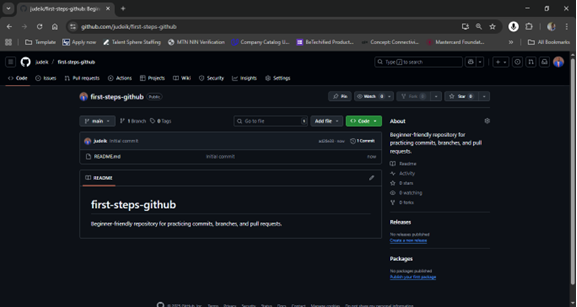
   
   *Figure 12: Repository initialized with README file.*

   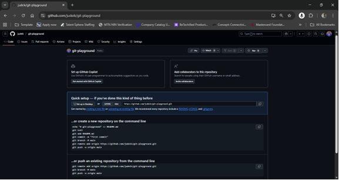
   
   *Figure 13: Repository setup without README file (default option).*

### 5) Clone the Repository (to Your Computer)

1. On your repo page, click **Code** → copy the **HTTPS link**.
    
   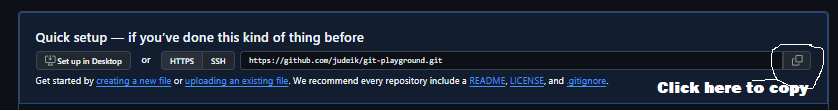
   
   *Figure 14: Copying the HTTPS link to clone your repository*

   Or download the repository as a **ZIP file**.
   
   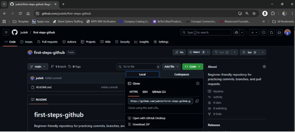
   
   *Figure 15: Alternative method: downloading a repository as a ZIP.*

3. Open the folder in **VS Code**.
    
   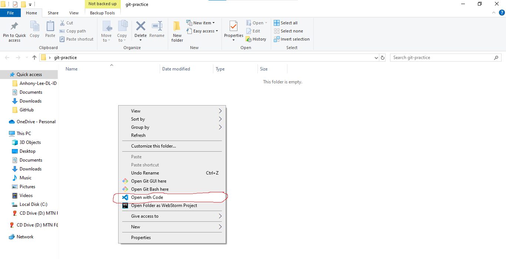
   
   *Figure 16: Opening the repository folder in Visual Studio Code.*  

   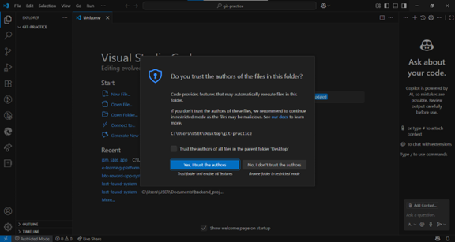
   
    *Figure 17: Trusting authors in VS Code workspace.*

   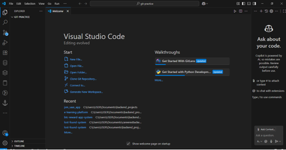
   
   *Figure 18: Closing the VS Code welcome tab for a clean workspace.*

   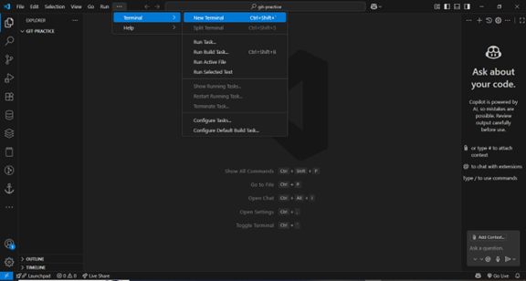
   
   *Figure 19: Opening terminal in VS Code.*

   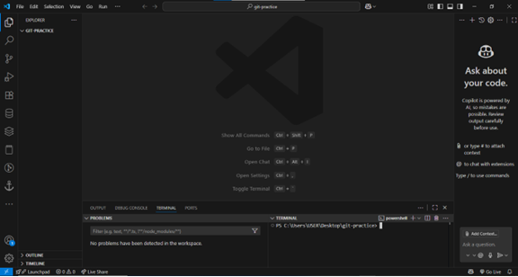
   
   *Figure 20: VS Code integrated terminal ready for Git commands.*

- Cloning the repository and navigating into it using VS Code terminal
  
  ```bash

   git clone https://github.com/username/my-first-repo.git
  
cd my-first-repo

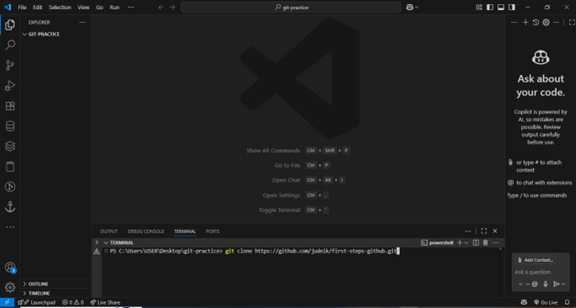

*Figure 21: Running git clone [https://github.com/username/my-first-repo.git](https://github.com/username/my-first-repo.git) followed by cd my-first-repo inside the VS Code integrated terminal.*

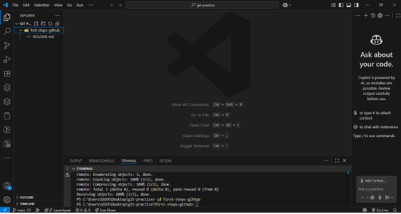

*Figure 22: Successful repository cloning into the local machine.*

### 6) Make Your First Change & Commit  

1. Create or edit a file (`README.md` or `index.html`) and save it.
    
   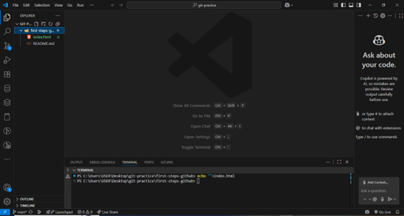
   
   *Figure 23: Creating a new file inside the repository.*  

   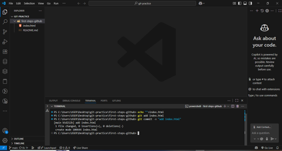
   
   *Figure 24: Example file contents created locally.*

3. Commit your changes:  

    ```bash

   git add README.md
    
   git commit -m "Add hello message"

### 7) Push to GitHub  

1. Push your changes to GitHub:  

    ```bash

   git push origin main

Refresh your repository page to see updates.

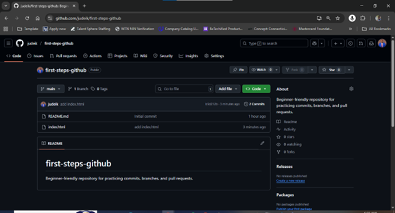

*Figure 25: Repository updated after pushing changes.*

### 8) Optional: Create or Edit Files on GitHub  

1. Open your repository on GitHub.  

2. Click **Add file → Create new file**, name it, and add content.
   
   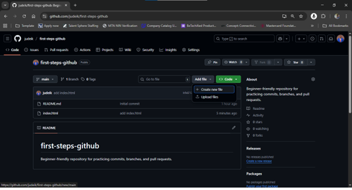
   
   *Figure 27: Adding a file directly in GitHub’s web editor.*

   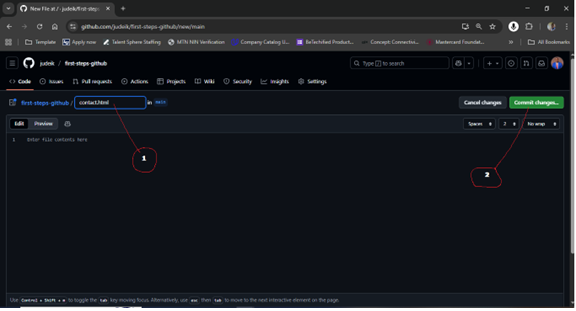
   
   *Figure 27: Adding a file directly in GitHub’s web editor.*  

4. Commit the new file.
   
   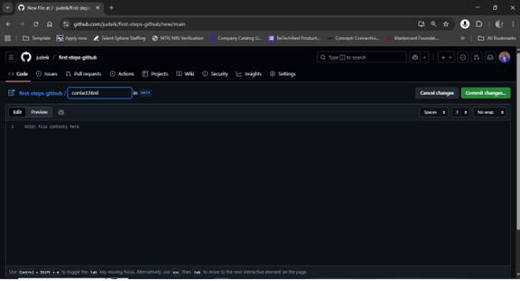

   *Figure 28: Committing a file using GitHub’s interface.*  

   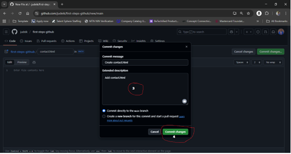

    *Figure 29: Writing a commit message before saving changes online.*

6. After a successful commit, the repository updates to show the new file and commit message.
   
   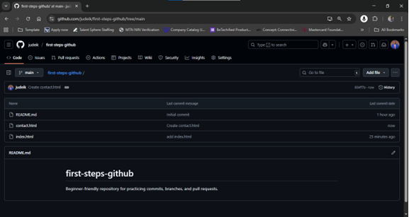
   
   *Figure 30: GitHub repository view after a successful commit, showing the newly added file and the commit message at the top.*

## Diagrams  

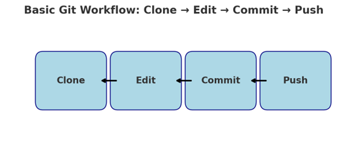

*Figure 31: Diagram of the Git workflow — working directory → staging area → repository.*  


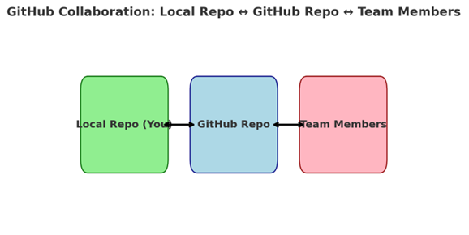

*Figure 32: Diagram of GitHub collaboration workflow — push, pull, fork, and merge requests.*

## Conclusion  

Congratulations! You’ve successfully:

- Created a GitHub account  
- Installed and configured Git  
- Created and cloned your first repository  
- Made and committed changes  
- Pushed updates to GitHub  

### Next Steps

- Learn about **branches, pull requests, and issues** for advanced collaboration.  
- Explore official Git documentation: [https://git-scm.com/doc](https://git-scm.com/doc)  
- Visit **GitHub Docs**: [https://docs.github.com](https://docs.github.com)  
- Read the free **Pro Git Book**: [https://git-scm.com/book/en/v2](https://git-scm.com/book/en/v2)  
